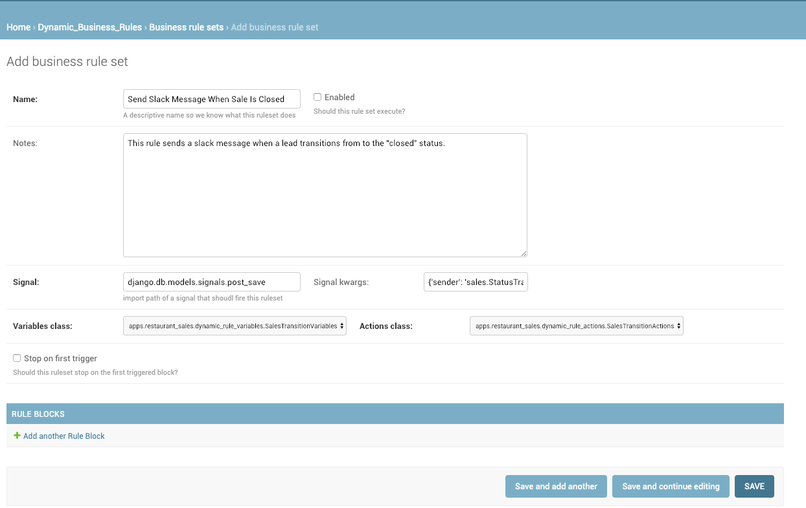
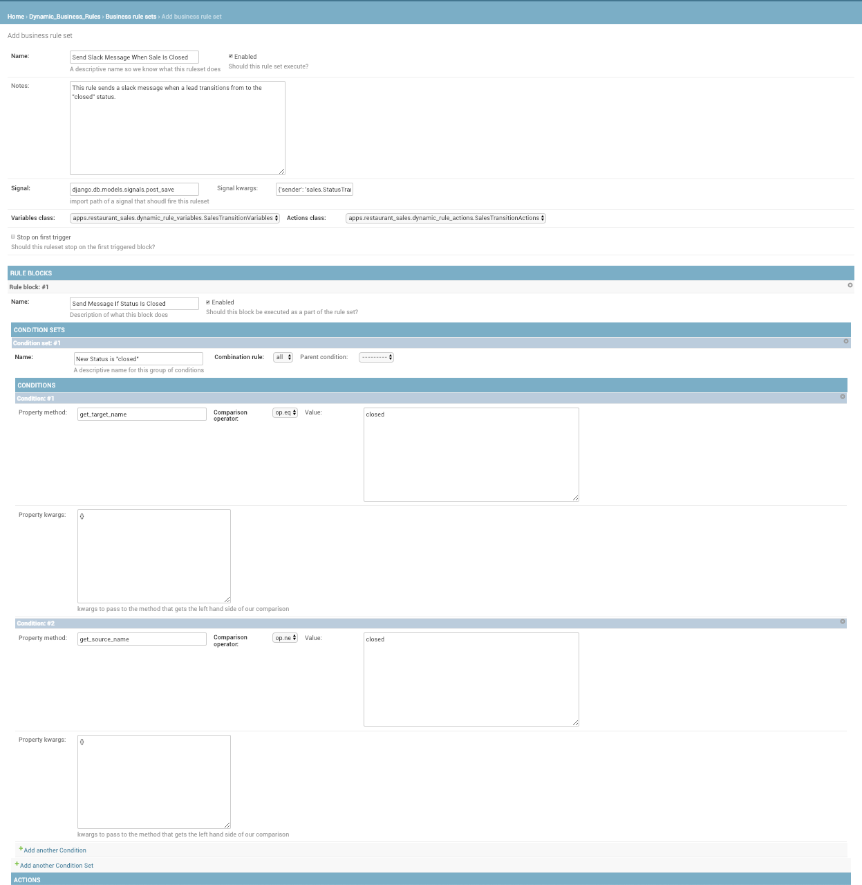

=============================
Django Dynamic Business Rules
=============================

.. image:: https://badge.fury.io/py/django-dynamic-business-rules.svg
    :target: https://badge.fury.io/py/django-dynamic-business-rules

.. image:: https://travis-ci.org/adamhaney/django-dynamic-business-rules.svg?branch=master
    :target: https://travis-ci.org/adamhaney/django-dynamic-business-rules

.. image:: https://codecov.io/gh/adamhaney/django-dynamic-business-rules/branch/master/graph/badge.svg
    :target: https://codecov.io/gh/adamhaney/django-dynamic-business-rules

A Django centric event driven rules engine for extensible and configurable responses to changes to django models and triggers.

Documentation
-------------

The full documentation is at https://django-dynamic-business-rules.readthedocs.io.

Use Cases
---------

* Configure Rules for sending messages to users and edit them without deploying new code
* Block spam users if they perform too many suspiscious activities during a certain time frame, allow non-programmer users to edit that time frame
* Trigger a required password reset if a configurable set of suspiscious behaviors are encountered

Key Ideas
---------

The goal of this project is to allow non-technical users to be able to
configure behaviors of the system, similar to a commercial tool like
IFFT or Zapier. Non-developer end users of this tool are not required
to be programmers but they will need to be at least somewhat technical
in their understanding of the system so for the remainder of the
document will will refer to them as "analysts".
  

Quickstart
----------

Install Django Dynamic Business Rules::

    pip install django-dynamic-business-rules

Add it to your `INSTALLED_APPS`:

.. code-block:: python

    INSTALLED_APPS = (
        ...
        'dynamic_business_rules.apps.DynamicBusinessRulesConfig',
        ...
    )

Add Django Dynamic Business Rules's URL patterns:

.. code-block:: python

    from dynamic_business_rules import urls as dynamic_business_rules_urls

    urlpatterns = [
        ...
        url(r'^admin/dynamic-rules/', include(dynamic_business_rules_urls)),
        ...
    ]

Create a Variable class

In one of your Django apps create a variable class in a file named
`dynamic_rule_variables.py` (this name must be used so we can
introspect apps looking for implementations of variable classes)

The Variable object translates a Django signal into a set of values
that non-technical users can use when creating conditional business
rules. For an example Variable object see example/dynamic_rule_variables.py you'll notice
that the variable object doesn't inherit from any object, it's
constructor receives a django signal as kwargs and then its properties
evaluate the properties of that signal (in the case of the example the
post_save signal's instance is a key value).

Create an Action class

In one of your Django apps create an action class in a file named
`dynamic_rule_actions.py` (this name must be used so we can
introspect apps looking for implementations of action classes)

The action object provides methods that rule sets can "fire" if all
their conditions evaluate to true.

Screenshots of Admin
--------------------

Creating a New Rule

Adding Conditions To Evaluate

    
Features
--------

* Allows users to implement and extend their own `Variable` and `Action` classes in a flexible way that allows you to build a business rules engine that fits the needs of your project.

Running Tests
-------------

Does the code actually work?

::

    source <YOURVIRTUALENV>/bin/activate
    (myenv) $ pip install tox
    (myenv) $ tox

Credits
-------

Tools used in rendering this package:

*  Cookiecutter_
*  `cookiecutter-djangopackage`_

.. _Cookiecutter: https://github.com/audreyr/cookiecutter
.. _`cookiecutter-djangopackage`: https://github.com/pydanny/cookiecutter-djangopackage
